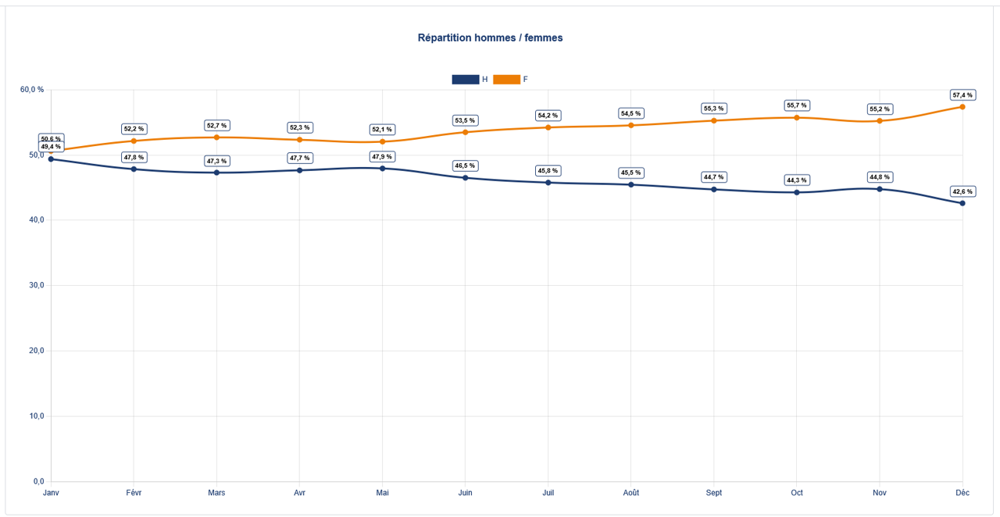

# Structure du Projet RHOBS

## Arborescence complète

```
/home/user/test/
│
├── index.html                          # Page d'accueil
├── index-egalite.html                  # Page Index Égalité Professionnelle
├── people-analytics.html               # Page People Analytics
├── analyse-temporelle.html             # Page Analyse Temporelle
├── masse-salariale.html                # Page Masse Salariale
├── transparence-salariale.html         # Page Transparence Salariale
├── contact.html                        # Page Contact avec formulaire
├── mentions-legales.html               # Mentions Légales et RGPD
│
├── css/
│   └── style.css                       # Tous les styles du site
│
├── js/
│   └── main.js                         # JavaScript (formulaire, animations, Calendly)
│
├── images/
│   ├── README.md                       # Guide des médias (vous y êtes!)
│   ├── hero-dashboard.png              # [À AJOUTER] Image accueil
│   ├── screenshot-analyse-temporelle.png # [À AJOUTER] Screenshot analyse temporelle
│   └── logo.png                        # [OPTIONNEL] Logo RHOBS
│
└── assets/
    └── (dossier pour assets divers)
```

## Chemins d'accès

### Chemin absolu du dossier images
```
/home/user/test/images/
```

### Chemin relatif dans le code HTML
```html
<!-- Depuis n'importe quelle page HTML à la racine -->

```

## Images actuellement référencées dans le code

### 1. Page d'accueil (index.html - ligne ~69)
```html

```

### 2. Page Analyse Temporelle (analyse-temporelle.html - ligne ~90)
```html

```

## Comment ajouter vos images maintenant

### Option 1 : Télécharger depuis une URL
```bash
# Exemple avec une vraie capture d'écran
cd /home/user/test/images/
wget -O hero-dashboard.png "https://votreserveur.com/images/dashboard.png"
```

### Option 2 : Copier depuis votre machine locale
```bash
# Si vous avez accès au système de fichiers
cp /chemin/local/dashboard.png /home/user/test/images/hero-dashboard.png
```

### Option 3 : Créer un placeholder temporaire
```bash
# Pour tester le site avec des images de remplacement
cd /home/user/test/images/
wget -O hero-dashboard.png "https://via.placeholder.com/800x500/1D3C70/FFFFFF?text=RHOBS+Dashboard"
wget -O screenshot-analyse-temporelle.png "https://via.placeholder.com/900x500/4D7DD1/FFFFFF?text=Analyse+Temporelle"
```

## Vérifier que les images sont bien présentes

```bash
# Lister le contenu du dossier images
ls -lh /home/user/test/images/

# Vérifier la taille des images
du -sh /home/user/test/images/*
```

## Tester le site localement

Si vous avez Python installé :
```bash
# Lancer un serveur web local
cd /home/user/test
python3 -m http.server 8000

# Puis ouvrir dans le navigateur : http://localhost:8000
```

## Next Steps

1. **Ajoutez vos images** dans `/home/user/test/images/`
2. **Testez le site** pour vérifier que tout s'affiche
3. **Committez les images** :
   ```bash
   git add images/
   git commit -m "feat: add website images and screenshots"
   git push
   ```

## Notes importantes

- Les images ont des **fallbacks SVG automatiques** si elles ne sont pas trouvées
- Le site fonctionne sans les images, mais c'est mieux avec !
- Format recommandé : **PNG** pour les captures d'écran
- Taille max recommandée : **1MB par image**
